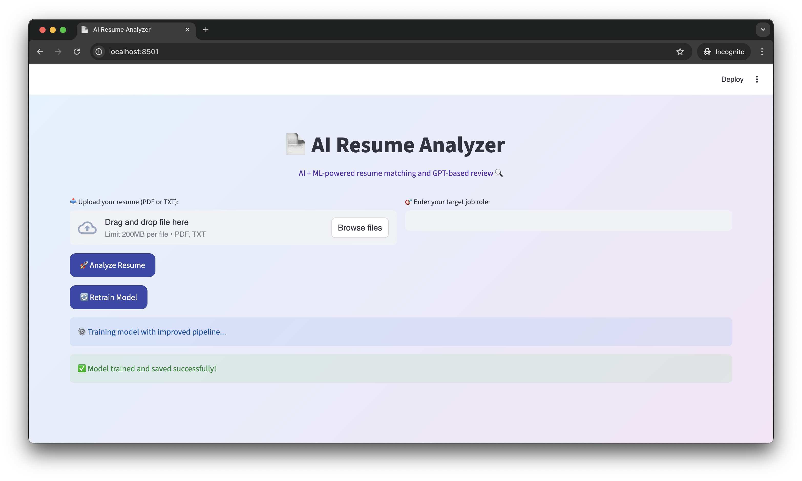
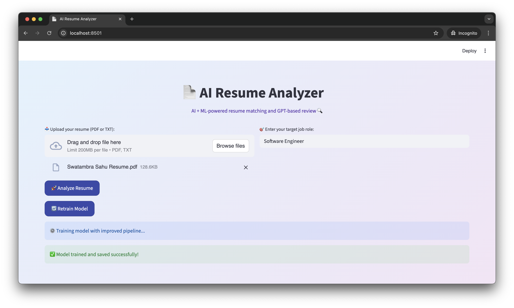
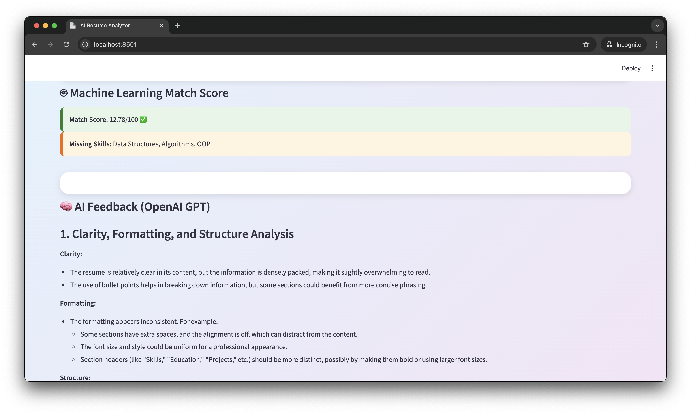
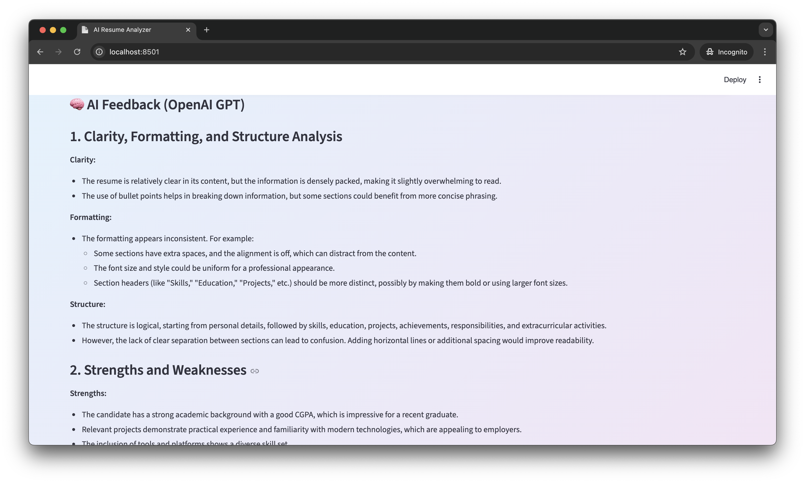
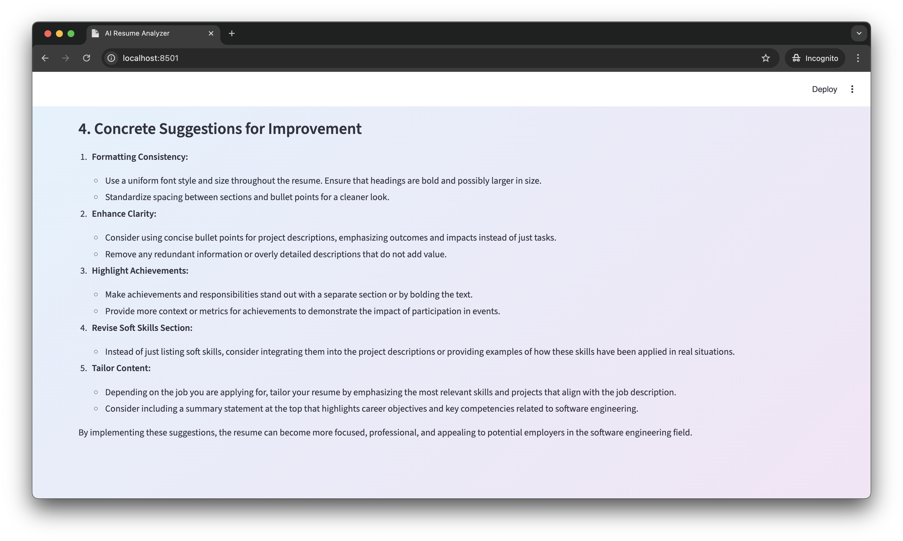
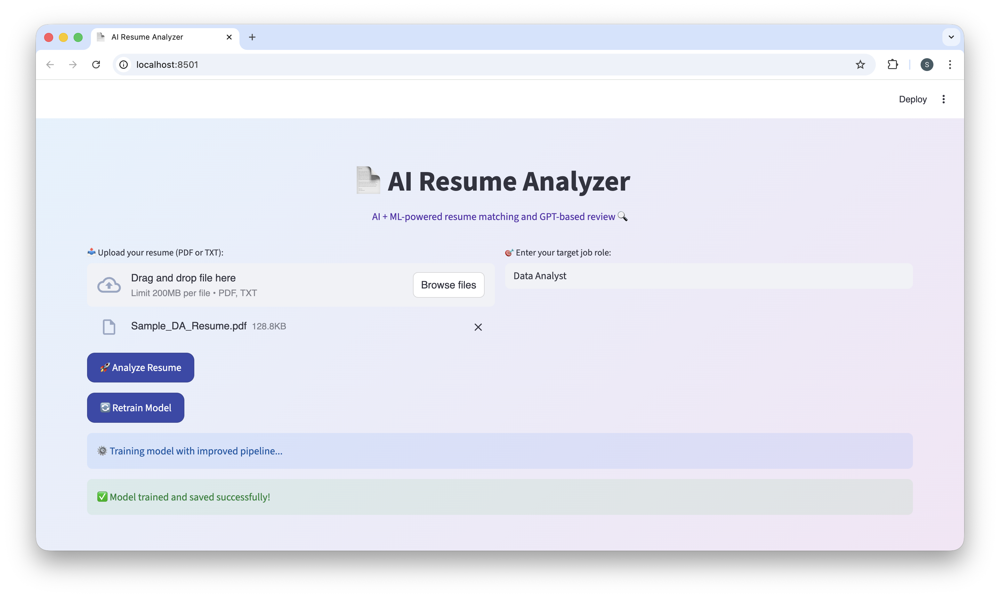

# 🤖 AI Resume Analyzer  
**Turning resumes into employability intelligence**  
*(Using Machine Learning and GPT-based evaluation)*

AI Resume Analyzer is a **Machine Learning–powered web application** that evaluates resumes against industry job roles to identify **ATS compatibility, skill gaps, and employability risks**. It combines **ML-based scoring** with **GPT-driven qualitative feedback** to deliver actionable, role-specific career insights.

---

## 🎯 Why This Project Matters

Most hiring pipelines rely on **Applicant Tracking Systems (ATS)**, causing many qualified candidates to be rejected due to:
- Missing skills or keywords  
- Poor resume structure  
- Misalignment with job-role expectations  

This project makes employability **measurable, explainable, and improvable**.

---

## 🚀 System Workflow

1. Resume upload (**PDF / TXT**)  
2. Text extraction & preprocessing  
3. Job-role skill comparison  
4. **ATS-style match score (0–100)**  
5. Missing skill detection  
6. **GPT-based resume feedback**  
7. Targeted upskilling guidance  

---

## 🧠 Technical Architecture

**Resume → NLP Pipeline → ML Scoring → GPT Evaluation → Insights**

- Text Extraction: PyPDF2  
- Feature Engineering: TF-IDF (unigrams + bigrams)  
- Classification: Logistic Regression  
- Similarity Measure: Cosine Similarity  
- AI Feedback: OpenAI GPT (structured prompt)  
- UI: Streamlit + Custom CSS  

---

## 🛠 Tech Stack

| Layer | Technology |
|------|-----------|
| Language | Python |
| Frontend | Streamlit, Custom CSS |
| ML / NLP | TF-IDF, Logistic Regression, scikit-learn |
| AI | OpenAI GPT (gpt-4o-mini) |
| Data | CSV job-role skill dataset |
| Model Storage | Joblib |
| Version Control | Git, GitHub |

---

## ⭐ Key Features

- **ATS-style resume scoring**
- **Job-role-specific skill gap detection**
- **GPT-powered clarity & formatting review**
- **Actionable improvement suggestions**
- **Retrainable ML pipeline**

---

## 📸 Application Screenshots

### Resume Upload & Home

### ATS Match Score

### AI Feedback & Suggestions

### Retrain Model

---

## 🎥 Demo Video
▶ **YouTube:**  
[https://youtu.be/pKJ_H0A4WZI](https://youtu.be/pKJ_H0A4WZI)

---

## 📂 Project Resources
📁 **Google Drive (Dataset, Report, Demo):**  
[https://drive.google.com/drive/folders/1iAqXHRZ6NO1KvY8vskt9pK0Aik_GJo2P?usp=drive_link](https://drive.google.com/drive/folders/1iAqXHRZ6NO1KvY8vskt9pK0Aik_GJo2P?usp=drive_link)

---

## 📌 Use Cases

- Campus placement preparation  
- Resume validation before ATS screening  
- Skill-gap analysis for upskilling  
- Career transition readiness  

---

## 🏁 Summary

**AI Resume Analyzer** showcases real-world application of **Machine Learning, NLP, and Generative AI** in hiring workflows, making it highly relevant for **software, data, and ML engineering roles**.

---
